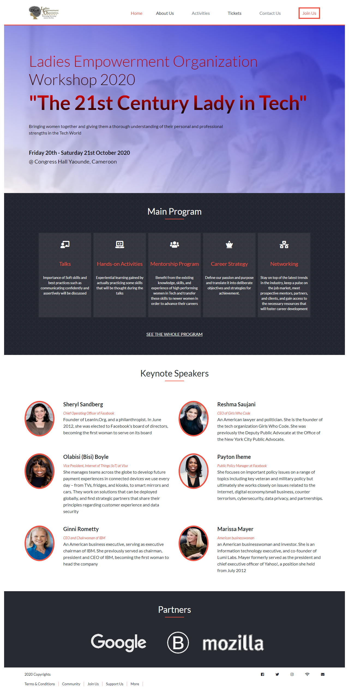

## PROJECT: HTML & CSS Capstone Project
> This is a replica of the design idea by [Cindy Shin in Behance](https://www.behance.net/gallery/29845175/CC-Global-Summit-2015) presenting the Ladies Empowerment Organization, LEO Workshop 2020.



This is a real-world-like project based on an online website for a conference which was built following the design idea by [Cindy Shin in Behance](https://www.behance.net/gallery/29845175/CC-Global-Summit-2015), but with a personalised content. 
The content presents a workshop organized by the Ladies Empowerment Organization every year to commemorate the world day of Women in Tech.

The project was completed with the aim of portraying a deep understanding of the HTML5, CSS3, Bootstrap, Sass and their best practises.
The website has 3 main pages, the home page, the about page and the tickets page.
Each of these pages consists of a navigation bar and a footer element.

- the homepage has several sections that contain background images and linear gradients. Some sections were positioned using flex, others used the grid system while some used bootstrap. the navigation bar used floats also to position the hidden menu list.

- the about page has a similar layout to the home page and has in addition to it, a carousel slide shows that were displayed using bootstrap. It also has a subscribe form to be filled

- the tickets page has a form with 2 sections, the table and the input elements with radio buttons.

This project covers the following HTML and CSS3 concepts
- Sass
- Bootstrap Framework
- Design and UX
- Floats and Positioning
- Flex and Grid
- Backgrounds

## Built With
- HTML
- CSS
- Bootstrap
- Sass

## Live Demo

[Live Demo Link](https://rawcdn.githack.com/Georjane/LEO-Workshop-Website/4c8ba386090289276b2ecbf36827e4dae9a19a9f/index.html)


## Getting Started
To get a local copy of this repository, please run the following commands on your terminal

```
$ cd <LEO Workshop>
```

```
$ git clone https://github.com/Georjane/LEO-Workshop-Website.git
```

To install the required sass node modules

```
$ npm install
```
Run SASS on command line to automatically compile to style.css

```
$ npm run sass-compile
```

## Author

👤 **Witah Ngu Geojane**

- Github: [@Georjane](https://github.com/Georjane)
- Twitter: [@WittyJany](https://twitter.com/WittyJany)
- Linkedin: [witah](https://www.linkedin.com/in/witah-georjane-74b8bb184)


# 🤝 Contributing

Contributions, issues and feature requests are welcome!

Feel free to check the [issues page](https://github.com/Georjane/LEO-Workshop-Website/issues).

## Show your support

Give a ⭐️ if you like this project!

## Acknowledgments

- This project is a design by [Cindy Shin in Behance](https://www.behance.net/gallery/29845175/CC-Global-Summit-2015)
- The project was inspired by the [Microverse](https://www.microverse.org/) program.

## 📝 License

This project is [MIT](lic.url) licensed.
